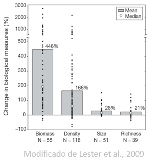
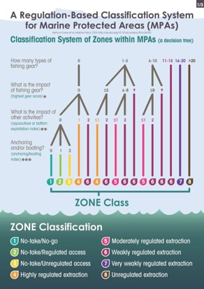
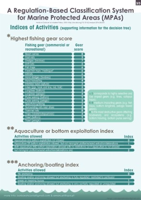
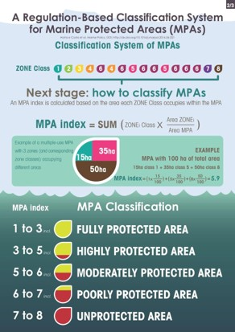
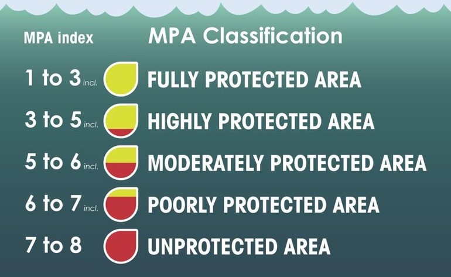

```{r setup, include=FALSE}
knitr::opts_chunk$set(echo = FALSE)

# options(knitr.table.format = "html")

suppressPackageStartupMessages({
  library(tidyverse)
})
```

## Temas

- Áreas Marinas Protegidas
- Categorización de AMPs:
    - Según sus objetivos
    - Según sus reglas
    - Ejemplo con Cabo Pulmo

## Áreas Marinas Protegidas (AMP)  {.smaller}

- Manejo espacial de actividades humanas (*e.g.* pesca, petróleo, turismo...)
- Evidencia de incrementos en algunos indicadores
    - Biomasa [@aburtooropeza_2011-ya; @lester_2009-Ks]
    - Densidad [@lester_2008-F_]
    - Resiliencia [@micheli_2012-EU]
    - Preservan diversidad genética [@munguavega_2015-yg]
    - ¿Beneficios a pesquerías?

<center></center>

## Gran discusión sobre su (falta de) efectividad pero ¿Por qué no funcionan?

- Respuestas clásicas:
    - Vigilancia
    - Fondos
    - Tamaño
    - Diseño
    - Tiempo
1. Muchos de los casos positivos vienen de Reservas Marinas (zonas de no pesca)
2. Estudios sin control apropiado
3. Tendemos a evaluar objetivos, no intervenciones

# Primer paso: Hablar de lo mismo

## Categorización de AMPs

- Gran diversidad de objetivos = gran diversidad de nombres:
    - Reserva de la Biosfera
    - Zona de Protección de Flora y Fauna
    - Parque Nacional
    - Santuario
    - Y sus sub-zonas...
- Existen dos maneras generales de categorizar una AMP
    - Según sus metas y objetivos [@iucn_website_2017-Bg]
    - Según sus regulaciones [@hortaecosta_2016-_3]

# Categorización de la IUCN

## Características {.larger}

- Enfocada en objetivos de manejo
- Reconocidas por la ONU y muchos paises
- Incorporadas en legislación
- Describe toda la AMP (no toma en cuenta zonificación)
- [Existen 7 categorías](https://www.iucn.org/es/node/26266)

## Categorias

- Ia Reserva Natural Estricta
- Ib Área de Vida Salvaje
- II Parque Nacional
- III Monumento Natural
- IV Área de Manejo de Hábitat / Especie
- V Paisaje Protegido
- VI Área protegida con uso adecuado de recursos naturales

## Categorias{.small}

```{r}
read.csv("tabs/B0/IUCNChars.csv") %>% 
  knitr::kable()
```

## Desventajas

- Diferencias entre tipos no están muy claras
    - *e.g.* V vs VI
- Enfocadas en objetivos de manejo
    - Comúnmente objetivos de manejo no se alínean con las regulaciones
- Clasifican el AMP entera, ignorando zonificación
- En meta-análisis evaluamos (erróneamente) los objetivos, no intervenciones.

# Categorización de @hortaecosta_2016-_3

## Categorización de @hortaecosta_2016-_3

- 8 clases de **zonas** y 5 clases de **AMP**
- Clase de AMP depende de clases de zonas
- Enfoque en regulaciones (usos permitidos)
- Sistema de "árbol de decisiónes"
- Cuantitativo
- Específico a las zonas
- Cálculo del "MPAindex"

## Clases de zona

1. No pesca / No acceso
2. No pesca / Acceso regulado
3. No pesca / Acceso no regulado
4. Extracción altamente regulada
5. Extracción moderadamente regulada
6. Extracción poco regulada
7. Extracción muy poco regulada
8. Extracción no regulada

## Categorización cuantitativa

<center>
[](./figs/B0/HortaTree.jpg) [](./figs/B0/HortaUses.jpg)
</center>

## Clases de AMP

- Se categorizan según el MPAindex como:
    1. Completamente protegida (1-3)
    2. Altamente protegida (3-5)
    3. Moderadamente protegida (5-6)
    4. Poco protegida (6-7)
    5. No protegida (7-8)

## MPAindex

<center>
[](./figs/B0/HortaMPAi.jpg)
</center>

# Ejemplo: Parque Nacional Cabo Pulmo

## Con IUCN

- 7,111 ha totales 
- 7,094.8 ha sin SUP (terrestre)

- IUCN:
    - Oficialmente Categoría II (Parque Nacional)
    - Pero sub-zonas tendrían diferentes categorías:
        - actividades de restauración e historia de explotación indicarían IV, V, VI...

## Con MPAindex [@hortaecosta_2016-_3]

$$\sum_{i = 1}^{n}Clase_i\times\frac{Area_i}{AreaAMP}$$

```{r}
read.csv("tabs/B0/PNCPindex.csv") %>% 
  knitr::kable(col.names = c("Zona", "Extensión", "Artes de pesca", "Puntaje más alto AP", "Acuacultura y fondo", "Embarcaciones", "Clase Zona", "Clase*(Area/AreaAMP)"), digits = 2)
```

## PNCP es Área completamente protegida



## Utilidad

- Informar manejo:

```{r, fig.height = 3, fig.width = 4, fig.align = "center"}
ggplot(mtcars, aes(x = hp/50, y = mpg/10)) +
  theme_bw() +
  labs(x = "MPAindex", y = "Efecto en Biomasa") +
  geom_smooth(method = "loess", color = "black", linetype = "dashed") +
  geom_point(size = 2)
```

- Forma cuantitativa de clasificar AMPs
- Permite comparar entre AMPs

## Referencias

